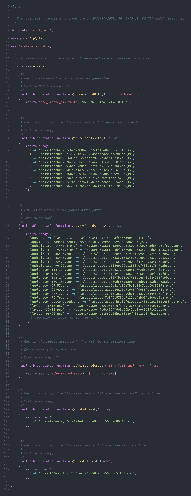

# urchin

`urchin` is a simple PHP command line tool for generating helpers for retrieving versioned assets output from [Vite](https://vitejs.dev/). Because the helpers store the contents of [the manifest](https://vitejs.dev/guide/backend-integration.html) in pure PHP there is no extra overhead resulting from having to parse the manifest.json file.

urchin was created specifically for my contributed web services for `super.fish` and _does_ require a specific, but simple, setup for it to work.

urchin assumes that

- Your Vite config is set up to generate a normal manifest.json file after building
- Your assets output from Vite are placed in an `/assets/` subdirectory in your website's public root

---

## Installation

Download the `urchin.phar` from the latest release.

## Usage

urchin can generate either a static helper class or a helper file containing functions.

 The helper class command requires 2 arguments, 1 option, and has 1 optional option:


```console
php urchin.phar generate-class ./path/to/class/dir ./path/to/manifest/file/dir --namespace=My\\Namespace -d
```

The above command will generate an `Assets.php` file located at `./path/to/class/dir/Assets.php` with the namespace `My\Namespace` from assets located in the manifest.json file at `./path/to/manifest/file/dir/manifest.json`. The `-d` flag will delete the manifest.json after generating the class.



The command for generating the simpler helper file is similar:

```console
php urchin.phar generate-helper ./path/to/helper/dir ./path/to/manifest/file/dir -d
```

This will generate an `assets.php` file located at `./path/to/helper/dir/assets.php` from assets located in the manifest.json file at `./path/to/manifest/file/dir/manifest.json`. This command also has the same `-d` flag.


